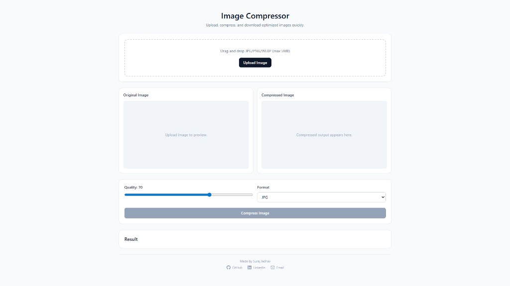
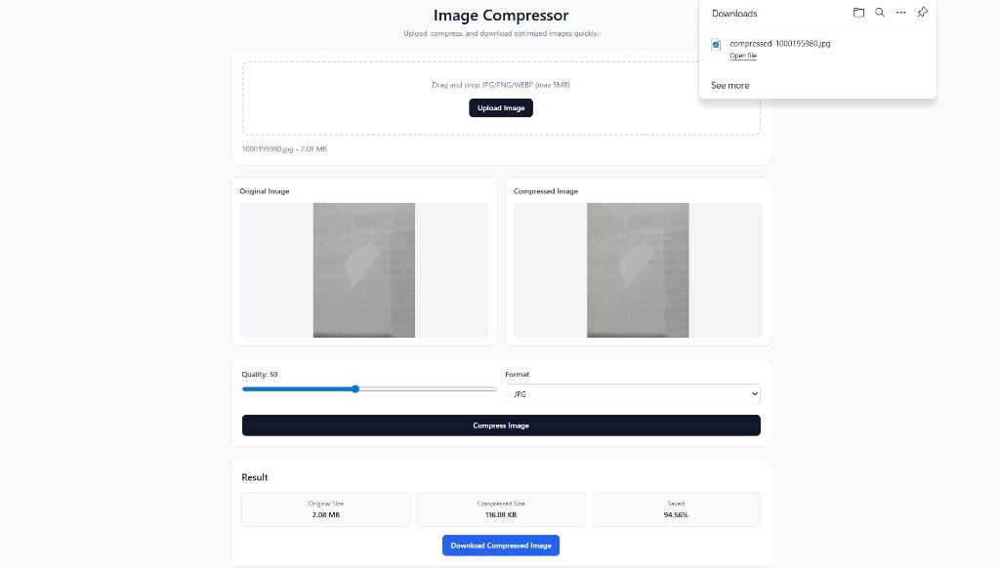

# 🖼️ Image Compressor (MERN)

A modern full-stack web app to compress and optimize images with real-time size reduction.

---

## ✨ Key Features

* 📤 Drag & drop image upload
* ⚙️ Adjustable compression quality (10%–90%)
* 📉 Real-time size reduction preview
* 📊 Before vs after comparison
* 📥 One-click download
* 🛡️ File validation and error handling

---

## ⚙️ How It Works

1. User uploads an image
2. Image is sent to backend via API
3. Backend processes image using Sharp
4. Compression is applied based on selected quality
5. Optimized image is returned for download

---

## 📸 Screenshots

### Home Screen

### Compression Result

---

## 🧱 Tech Stack

### Frontend

* React (Vite)
* Tailwind CSS

### Backend

* Node.js
* Express.js
* Multer (file upload)
* Sharp (image processing)

### Database

* MongoDB (optional, used for storing metadata if enabled)

---

## 📁 Project Structure

image-compressor/
├─ backend/
├─ frontend/
├─ assets/
└─ README.md

---

## 🚀 Local Setup

### 1. Clone repo

git clone <your-repo-url>
cd image-compressor

### 2. Install dependencies

Backend:
cd backend
npm install

Frontend:
cd ../frontend
npm install

---

### 3. Setup environment variables

Backend:
copy .env.example .env

Frontend:
copy .env.example .env

---

### 4. Run project

Backend:
cd backend
npm run dev

Frontend:
cd frontend
npm run dev

---

## 🔗 API Endpoints

POST /upload
POST /compress
GET /download/:id
GET /health

---

## 🚀 Future Improvements

* Batch image compression
* Image format conversion (PNG ↔ JPG ↔ WEBP)
* Multiple file upload
* Cloud storage (AWS S3)

---

## 📄 License

This project is licensed under the MIT License.
